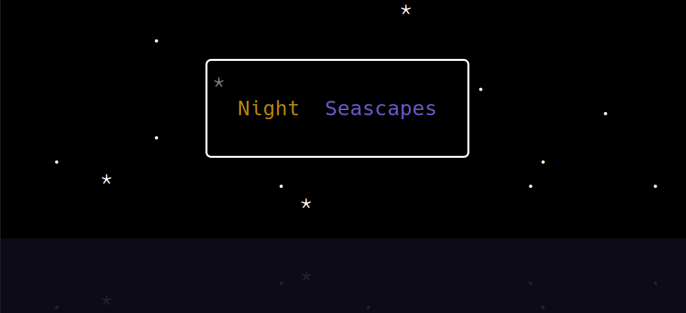

<!-- Improved compatibility of back to top link: See: https://github.com/othneildrew/Best-README-Template/pull/73 -->
<a name="readme-top"></a>
<!--
*** Thanks for checking out the Best-README-Template. If you have a suggestion
*** that would make this better, please fork the repo and create a pull request
*** or simply open an issue with the tag "enhancement".
*** Don't forget to give the project a star!
*** Thanks again! Now go create something AMAZING! :D
-->


<!-- PROJECT SHIELDS -->
<!--
*** I'm using markdown "reference style" links for readability.
*** Reference links are enclosed in brackets [ ] instead of parentheses ( ).
*** See the bottom of this document for the declaration of the reference variables
*** for contributors-url, forks-url, etc. This is an optional, concise syntax you may use.
*** https://www.markdownguide.org/basic-syntax/#reference-style-links
-->
[![Forks][forks-shield]][forks-url]
[![Stargazers][stars-shield]][stars-url]
[![Issues][issues-shield]][issues-url]
[![GNU License][license-shield]][license-url]


<!-- PROJECT LOGO -->
<br />
<div align="center">

<h3 align="center">Ansi Renderer</h3>

  <p align="center">
    Simple C# object oriented terminal rendering library with 24 bit color and transparency. Inspired in structure by HTML and JS.
    <br />
    <br />
    <a href="https://github.com/ANicon111/AnsiRenderer/issues">Report Bug</a>
    ·
    <a href="https://github.com/ANicon111/AnsiRenderer/issues">Request Feature</a>
  </p>
</div>


### Built With [![Csharp][Csharp.dev]][Csharp-url]


<!-- TABLE OF CONTENTS -->
<br />
<br />
<details>
  <summary>Table of Contents</summary>
  <ol>
    <li><a href="#getting-started">Getting Started</a></li>
    <li><a href="#documentation">Documentation</a></li>
    <li><a href="#contributing">Contributing</a></li>
    <li><a href="#license">License</a></li>
    <li><a href="#contact">Contact</a></li>
  </ol>
</details>


<!-- GETTING STARTED -->
## Getting Started

1. Make sure to install the [.NET framework](https://dotnet.microsoft.com/)
2. Clone the repo
   ```sh
   git clone https://github.com/ANicon111/AnsiRenderer.git
   ```
3. Run the tests
   ```csharp
   using AnsiRenderer;
   Tests.Run();
   ```
4. Create your own stuff using the methods provided in the [documentation](#documentation)


<p align="right">(<a href="#readme-top">back to top</a>)</p>

<!-- GETTING STARTED -->
## Example

```csharp
using AnsiRenderer;

//Tests.Run();

Color waterColor = Colors.DarkSlateBlue.WithLuminosity(0.1).WithAlpha(0.7);
Renderer renderer = new();
renderer.Object = new(
subObjects:
    new RendererObject[]{
        new(
            text:
            """
                                            *                      
                        .                                          
                                                                   
                             *                    .                
                                        .                   .      
                        .                        .                 
                .                        .             .           
                    *             .                   .         .  
                                    *                              
            ▁▁▁▁▁▁▁▁▁▁▁▁▁▁▁▁▁▁▁▁▁▁▁▁▁▁▁▁▁▁▁▁▁▁▁▁▁▁▁▁▁▁▁▁▁▁▁▁▁▁▁▁▁▁▁
                                                                   
                                  . *                 .         .  
                .   *                    .             .           
            """,
            colorAreas:
            new ColorArea[]{
                new(Colors.Black,false,new(0,0,55,13)),
                new(Colors.White,true,new(0,0,55,13)),
                new(Colors.Black,true,new(0,3,55,1)),
                new(Colors.Black.WithLuminosity(0.3),true,new(0,5,55,3)),
                new(waterColor,true,new(0,5,55,4)),
                new(waterColor,false,new(0,5,55,3)),
            },
            subObjects:
            new RendererObject[]{
                new(
                    text:
                    """
                    ╭────────────────────╮
                    │                    │
                    │  Night  Seascapes  │
                    │                    │
                    ╰────────────────────╯
                    """,
                    colorAreas:
                    new ColorArea[]{
                        new(Colors.Black.WithAlpha(0.5),false,new(0,0,30,5)),
                        new(Colors.SlateBlue,true,new(3,0,9,1)),
                        new(Colors.DarkGoldenrod,true,new(-6,0,5,1)),
                    },
                    internalAlignmentX:Alignment.Center,
                    internalAlignmentY:Alignment.Center,
                    y: -2
                ),
            },
            internalAlignmentX:Alignment.Center,
            internalAlignmentY:Alignment.Center
        )
    },
    y: 1
);
renderer.Reset();
renderer.Update();

//go to the end of the image to not overlap it with text
Console.SetCursorPosition(0, renderer.Object.Height + 2);
```

The code above draws this image:


<p align="right">(<a href="#readme-top">back to top</a>)</p>


<!-- DOCUMENTATION -->
## Documentation

### Colors:
To encode colors you can use any of the following methods:
```csharp
//red, green, blue, [alpha]
new Color(r,g,b);
new Color(r,g,b,a);

//hue, saturation, luminosity, [alpha]
Color.FromHSLA(h,s,l);
Color.FromHSLA(h,s,l,a);

//a 32 bit unsigned integer can fully represent a 24 bit color with 8 bits for alpha
Color.FromUint(0xRRGGBBAA);

//C# enum of html colors
Colors.ColorName;

//HTML-like string notations
new Color("#RGB");
new Color("#RGBA");
new Color("#RRGGBB");
new Color("#RRGGBBAA");
new Color("rgb (r, g, b)");
new Color("rgba (r, g, b, a)");
new Color("hsl (h, s, l)");
new Color("hsla (h, s, l, a)");
new Color("colorName");
```

To modify a color, you can use the following methods:

```csharp
//this can be used to change the following values: Red, Green, Blue, Hue, Saturation, Lightness, Alpha
Color newColor = color.WithVALUE();

//overlays two colors
Color newColor = color1.WithOverlay(color2);
```

### Renderer objects:
All compositing is implemented by the RendererObject class, that can store the following information:

```csharp
new RendererObject(

//object geometry: Rectangle with x,y,width,height
geometry: null,

//if the object geometry isn't specified, then the constructor will automatically guess it, with the offset being specified here
x: 0,
y: 0,

//utf-8 text that represents the object's graphics
text: "",

//list of utf-8 texts that represents the object's animation
animation: null,

//starting frame of the animation
startFrame: 0,

//list of objects that gets rendered above this one
subObjects: null,

//list of colors and their geometries for the current object
colorAreas: null,

//internal alignment for text, animation, subObjects and colorAreas
internalAlignmentX: Alignment.Start,
internalAlignmentY: Alignment.Start,

//external alignment that overrides the internal alignment of the parent
externalAlignmentX: null,
externalAlignmentY: null
)
```

To manipulate the state of any object, you can use the following setters and methods:

```csharp
rendererObject.X = x;
rendererObject.Y = y;
rendererObject.InternalAlignmentX = newAlignmentX;
rendererObject.InternalAlignmentY = newAlignmentY;
rendererObject.ExternalAlignmentX = newAlignmentX;
rendererObject.ExternalAlignmentY = newAlignmentY;
rendererObject.Frame = newAnimationFrame;
//returns/sets a reference to a list of RendererObjects
rendererObject.SubObjects; 
//returns/sets a reference to a list of ColorAreas
rendererObject.ColorAreas;
```

This automatically marks the parents and (if necessary) the object for redrawing. Only the objects that are marked for updating will recalculate their pixel values.

Additionally, the `rendererObject.Update()` and `rendererObject.UpdateParent()` methods are exposed if they are needed for any reason.

The width, height and graphics (text and animation) of an object are immutable. To change them you need to create a new object.

### Renderer

The class that handles the drawing of objects to the terminal.

```csharp
//gets/sets the rendered object of the renderer
renderer.Object = rendererObject;

//updates everything on screen. If resize is false, then the function will not update the internal geometry of the terminal when it changes. Since the renderer calls Reset when it resizes otherwise, it's also a way so contain the changes of the renderer within the confines of an object.
renderer.Update(resize);

//updates terminal width and height, resets all pixels and redraws everything.
renderer.Reset();

//gets the internal terminal size of the renderer
renderer.TerminalWidth;
renderer.TerminalHeight;
```


<p align="right">(<a href="#readme-top">back to top</a>)</p>
<!-- CONTRIBUTING -->
## Contributing

Contributions are what make the open source community such an amazing place to learn, inspire, and create. Any contributions you make are **greatly appreciated**.

If you have a suggestion that would make this better, please fork the repo and create a pull request. You can also simply open an issue with the tag "enhancement".
Don't forget to give the project a star! Thanks again!

1. Fork the Project
2. Create your Feature Branch (`git checkout -b feature/AmazingFeature`)
3. Commit your Changes (`git commit -m 'Add some AmazingFeature'`)
4. Push to the Branch (`git push origin feature/AmazingFeature`)
5. Open a Pull Request

<p align="right">(<a href="#readme-top">back to top</a>)</p>


<!-- LICENSE -->
## License

Distributed under the GNU General Public License. See `LICENSE` for more information.

<p align="right">(<a href="#readme-top">back to top</a>)</p>


<!-- CONTACT -->
## Contact

Nicon-Georgian Albu - nicon@containrr.com

Project Link: [https://github.com/ANicon111/AnsiRenderer](https://github.com/ANicon111/AnsiRenderer)

<p align="right">(<a href="#readme-top">back to top</a>)</p>


<!-- MARKDOWN LINKS & IMAGES -->
<!-- https://www.markdownguide.org/basic-syntax/#reference-style-links -->
[forks-shield]: https://img.shields.io/github/forks/ANicon111/AnsiRenderer.svg?style=for-the-badge
[forks-url]: https://github.com/ANicon111/AnsiRenderer/network/members
[stars-shield]: https://img.shields.io/github/stars/ANicon111/AnsiRenderer.svg?style=for-the-badge
[stars-url]: https://github.com/ANicon111/AnsiRenderer/stargazers
[issues-shield]: https://img.shields.io/github/issues/ANicon111/AnsiRenderer.svg?style=for-the-badge
[issues-url]: https://github.com/ANicon111/AnsiRenderer/issues
[license-shield]: https://img.shields.io/github/license/ANicon111/AnsiRenderer.svg?style=for-the-badge
[license-url]: https://github.com/ANicon111/AnsiRenderer/blob/master/LICENSE
[product-screenshot]: images/screenshot.png
[Csharp.dev]: https://img.shields.io/badge/C%23-FFF?style=for-the-badge&logo=csharp&logoColor=blue
[Csharp-url]: https://dotnet.microsoft.com/en-us/languages/csharp
